# Manual do Usuário — Sis-Cred

Guia de uso do sistema de análise de crédito digital. Descreve como acessar o sistema e o que cada perfil de usuário pode fazer.

## 1. Visão geral do processo

O Sis-Cred digitaliza o fluxo de análise de crédito de um novo cliente, do cadastro pelo vendedor até a liberação (ou negativa) do limite pela gestão:

```
Vendedor cadastra o cliente (RECEBIDA)
        ↓
Analista faz a triagem e monta o dossiê (EM_ANALISE)
        ↓
Analista envia o dossiê completo para a gestão (AGUARDANDO_GESTAO)
        ↓
Gestão aprova ou nega o crédito (APROVADA / NEGADA)
        ↓
Analista confirma a atualização no sistema Prático (histórico)
```

Em cada etapa, o vendedor pode acompanhar o andamento em "Minhas solicitações" e recebe e-mail quando a gestão decide.

## 2. Acesso ao sistema

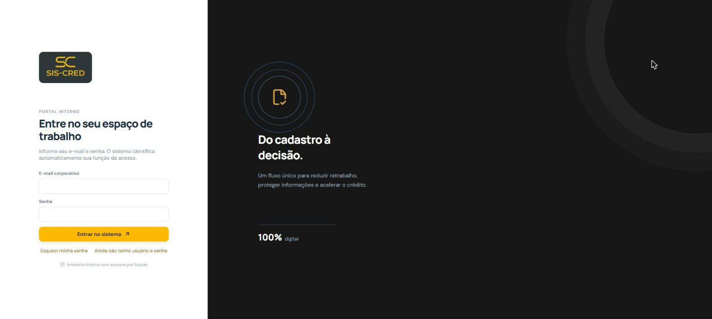

- **URL da interface**: endereço configurado pela empresa (em ambiente de desenvolvimento, `http://localhost:5173`).
- **Login**: e-mail corporativo + senha. O sistema identifica automaticamente a função do usuário e libera as telas correspondentes.
- **Criar conta**: apenas o perfil **Vendedor** pode se autocadastrar, pela tela de login em "Ainda não tenho usuário e senha" (nome, e-mail e senha). Os demais perfis (Analista, Gestão, Administrador) só são criados por um usuário de Gestão ou Administrador, na tela **Usuários**.
- **Esqueci minha senha**: na tela de login, em "Esqueci minha senha", informe o e-mail cadastrado. Se existir conta, um link de redefinição válido por 30 minutos é enviado por e-mail.
- **Regra de senha**: mínimo de 8 caracteres, com letras e números.

### Funções comuns a todos os perfis

Disponíveis no menu do perfil (canto superior direito), para qualquer usuário logado:

- **Editar perfil**: alterar nome e foto de perfil (JPG, PNG ou WEBP, até 3MB) ou remover a foto atual.
- **Trocar senha**: exige a senha atual, a nova senha e confirmação.
- **Sair do sistema** (logout).
- **Notificações** (sino no topo): avisos relevantes ao perfil (para a Analista, decisões da gestão pendentes de confirmação no Prático).

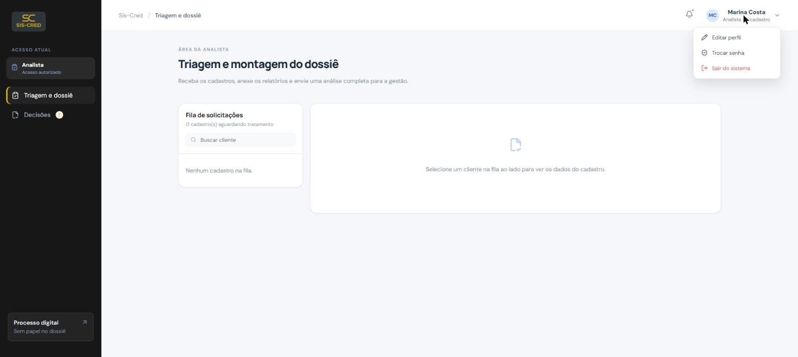

## 3. Perfis de usuário

| Perfil (interface) | Perfil (sistema) | Resumo do papel |
|---|---|---|
| Vendedor | `VENDEDOR` | Cadastra clientes e acompanha o resultado das solicitações que enviou |
| Analista | `ANALISTA` | Faz a triagem, monta o dossiê com relatórios de crédito e confirma a atualização final no Prático |
| Gestão | `GESTORA` | Aprova ou nega o crédito e gerencia usuários (exceto Administradores) |
| Administrador | `ADMIN` | Acesso total: gestão de qualquer usuário, visão administrativa e auditoria completa |

## 4. Vendedor

Menu lateral: **Novo cadastro** e **Minhas solicitações**.

### 4.1 Novo cadastro (ficha cadastral)

Formulário para abrir uma solicitação de crédito para um cliente novo ou existente:

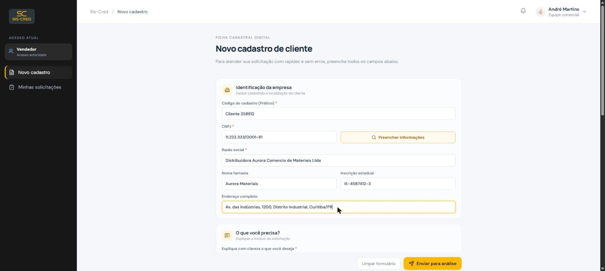

- **Identificação da empresa**: código do cadastro no Prático, CNPJ (com botão **"Preencher informações"** que consulta a Receita Federal via BrasilAPI e preenche razão social, nome fantasia, telefone e endereço automaticamente — apenas para CNPJ numérico tradicional), razão social, nome fantasia, inscrição estadual, endereço.
- **Motivo da solicitação**: texto livre explicando o que o vendedor precisa (aprovação, aumento de limite, novo cadastro etc.).
- **Contato do cliente**: nome(s), telefone(s) e e-mail(s) de contato (é possível adicionar mais de um de cada, com o botão "+"), e-mail para nota fiscal/avisos de vencimento e e-mail financeiro.
- **Perguntas obrigatórias**: origem do cliente, forma de autorização de compra, tipo de entrega e local de entrega (com campo de endereço alternativo se não for na própria empresa).
- **Documentos**: anexar o contrato social ou certificado de MEI em PDF (obrigatório para enviar a ficha) e observações internas do vendedor.
- Botões: **Limpar formulário** e **Enviar para análise**.

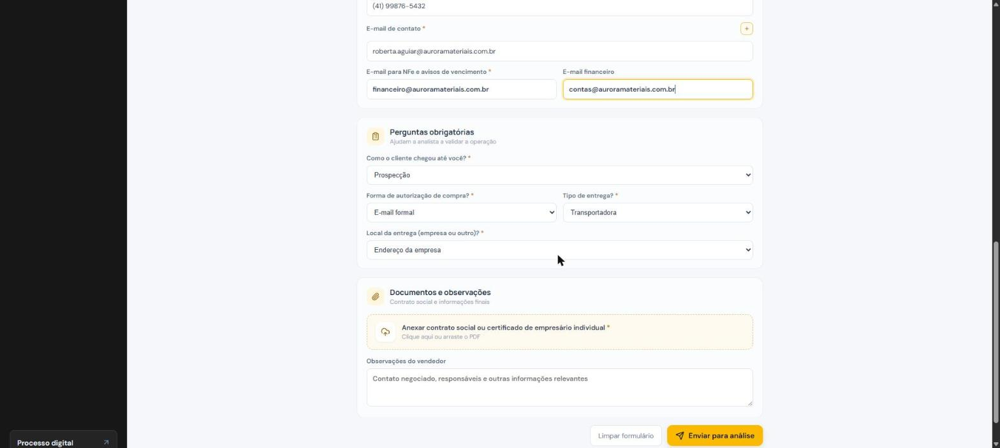

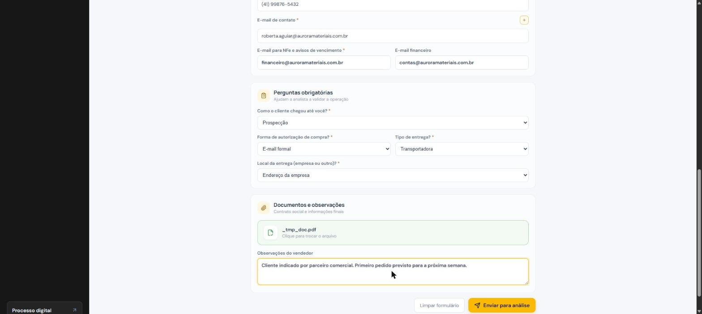

Ao enviar, a solicitação recebe um número de protocolo e segue para a fila da Analista.

### 4.2 Minhas solicitações

Lista de todos os clientes que o vendedor cadastrou, com status atual (Recebida, Em análise, Aguardando gestão, Aprovada, Negada). Ao clicar em um cliente é possível ver:

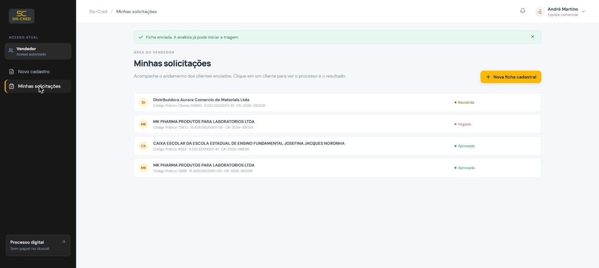

- Linha do tempo do processo (Recebida → Em análise → Aguardando gestão → Decisão).
- Resultado da decisão quando concluída: limite aprovado (se aprovado) e a mensagem que a gestão escreveu para o vendedor.

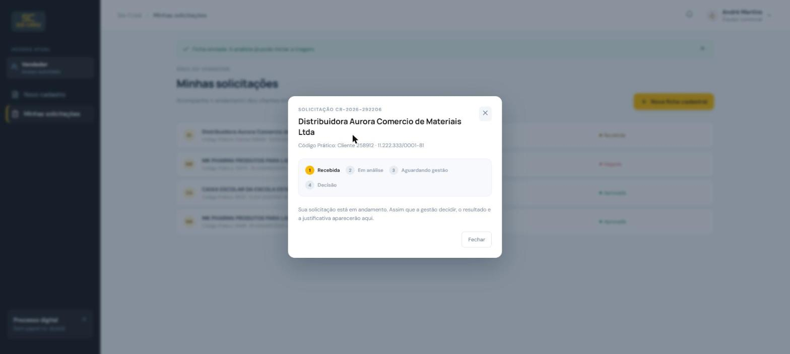

O vendedor **não** vê a justificativa interna da decisão nem os documentos de crédito (Serasa/DEPS) — apenas o resultado final e a mensagem destinada a ele.

## 5. Analista

Menu lateral: **Triagem e dossiê** e **Decisões** (com contador de pendências).

### 5.1 Triagem e dossiê

- Fila com todas as solicitações em status "Recebida" ou "Em análise", com busca por cliente.
- Ao selecionar um cliente, exibe todos os dados da ficha enviada pelo vendedor (identificação da empresa, contato, perguntas obrigatórias, observações) e o contrato social anexado (visualizável).

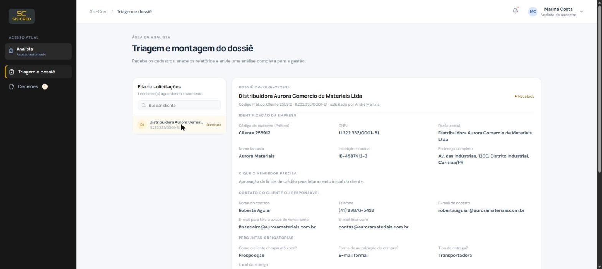

- **Upload dos relatórios de crédito**: anexar em PDF a **Consulta Serasa** e a **Avaliação DEPS** do cliente.
- Assim que os dois relatórios são anexados, o sistema exibe um resumo com dados extraídos (classificação DEPS, limite sugerido, nível de risco, protestos, PEFIN, histórico de pagamento).
- Botão **Enviar dossiê para gestão**: só é liberado depois dos dois relatórios anexados; muda o status da solicitação para "Aguardando gestão".

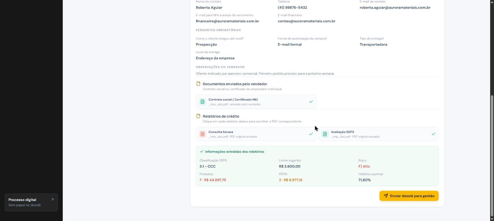

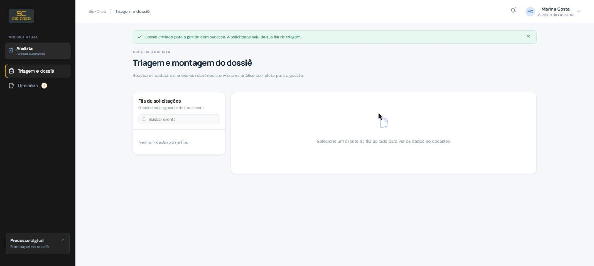

### 5.2 Decisões

Duas listas:

- **Pendentes de confirmação**: solicitações já decididas pela gestão (aprovadas ou negadas) que ainda não foram atualizadas no sistema Prático. Para cada uma: **Ver dossiê** (dados completos + resultado da decisão) e **Confirmar no Prático** — ao confirmar, a solicitação sai da fila pendente, vai para o histórico e o vendedor recebe um e-mail avisando que a atualização foi concluída.
- **Histórico**: decisões já confirmadas no Prático, com quem confirmou e quando.

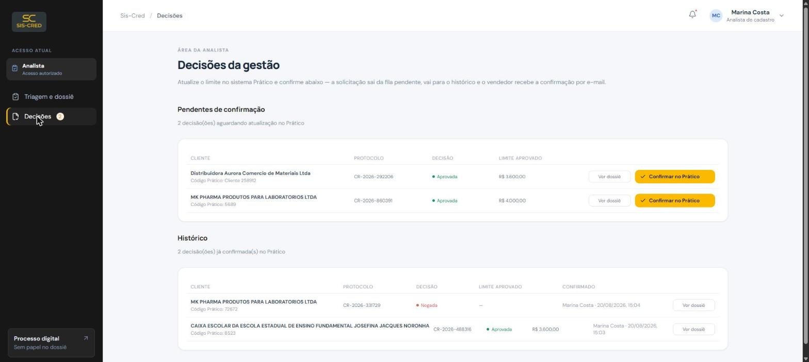

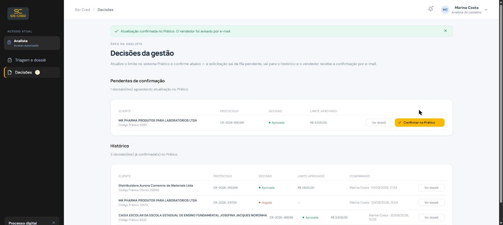

## 6. Gestão

Menu lateral: **Decisão de crédito**, **Usuários** e **Auditoria**.

### 6.1 Decisão de crédito

- Fila com as solicitações que a Analista enviou (status "Aguardando gestão").
- Ao selecionar uma solicitação, mostra o resumo da análise (classificação DEPS, pontuações, tabela de risco: protestos, PEFIN, histórico de pagamento, consultas recentes) e os PDFs originais do Serasa e do DEPS para visualização.

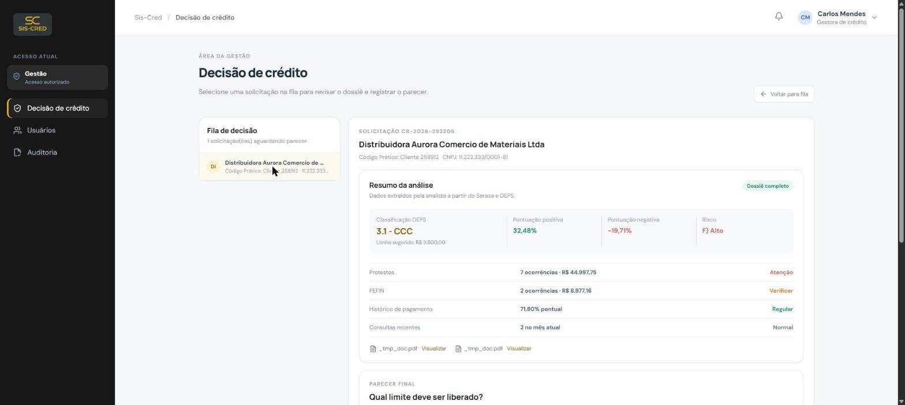

- **Parecer final**:
  - Limite a ser aprovado (valor editável, pré-preenchido com o limite sugerido).
  - Justificativa interna (visível só para gestão e analista).
  - Mensagem para o vendedor (o que ele verá em "Minhas solicitações").
  - E-mail para envio do resultado (pré-preenchido com o e-mail do vendedor, editável).
  - Botões **Negar crédito** / **Aprovar crédito** — ao decidir, um e-mail com o resultado é enviado automaticamente para o endereço informado e a solicitação sai da fila de decisão.

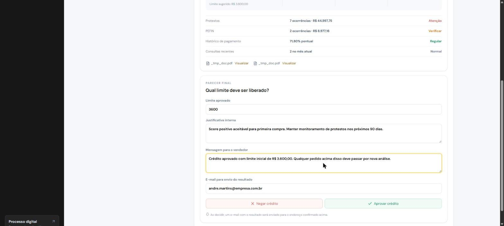

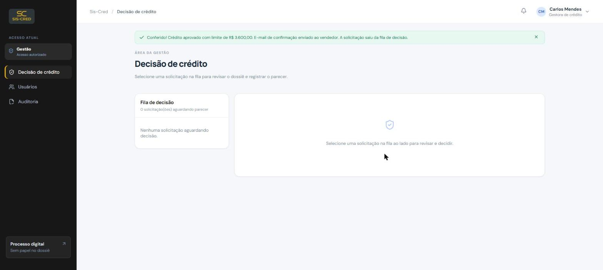

### 6.2 Usuários

Gestão pode criar, suspender/reativar e trocar a senha de usuários dos perfis **Vendedor, Analista e Gestão** (não pode gerenciar Administradores):

- **Criar usuário**: nome, e-mail corporativo, função e senha inicial.
- **Trocar senha**: define uma nova senha para o usuário selecionado.
- **Suspender / Reativar**: bloqueia ou libera o acesso do usuário sem excluir o cadastro.

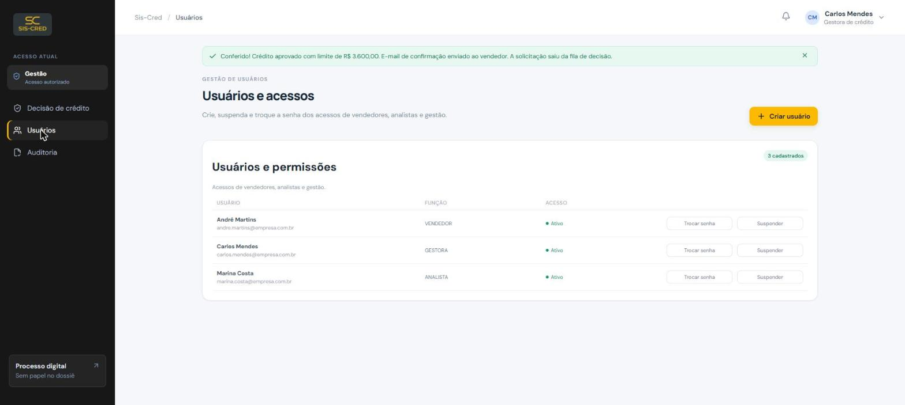

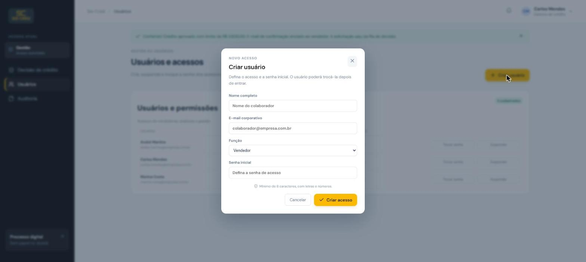

### 6.3 Auditoria

Mesma tela de auditoria do Administrador (ver seção 7.3) — visão completa de todas as solicitações e da trilha de eventos do sistema.

## 7. Administrador

Menu lateral: **Administração**, **Usuários** e **Auditoria**. Tem acesso total do sistema, incluindo tudo o que Vendedor, Analista e Gestão fazem.

### 7.1 Administração

Painel com indicadores gerais:

- Usuários ativos.
- Total de solicitações cadastradas.
- Documentos no dossiê.
- Eventos auditados.
- Conferências rápidas de saúde do sistema (conexão com o banco, fila de crédito, auditoria, documentos).

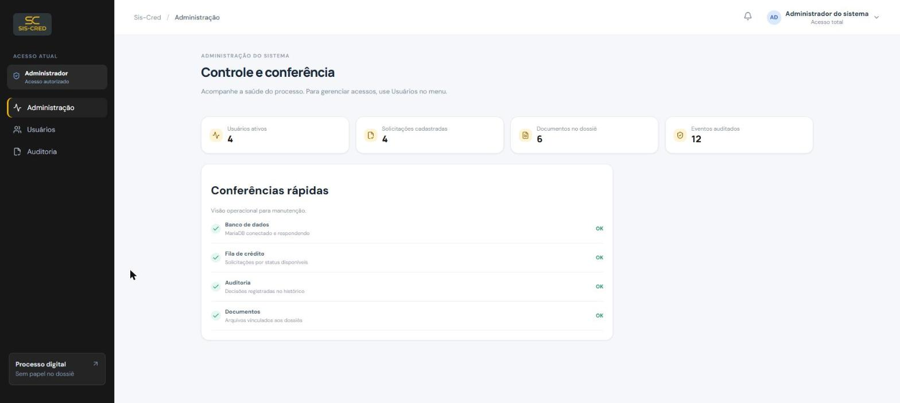

### 7.2 Usuários

Igual à tela de Usuários da Gestão, mas o Administrador também pode criar, suspender e trocar a senha de **outros Administradores** — é o único perfil com esse alcance.

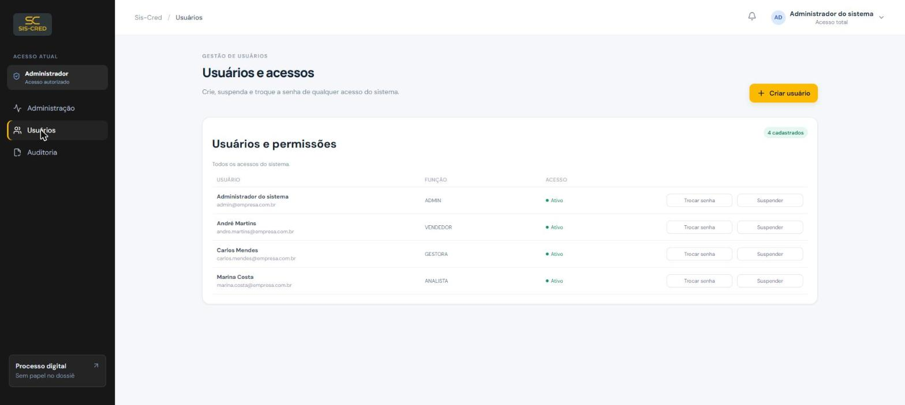

### 7.3 Auditoria

- **Todas as solicitações**: lista completa, filtrável por status, com contadores por status. Cada linha abre o dossiê completo (documentos anexados e, se decidida, os dados da decisão e assinatura de quem decidiu).

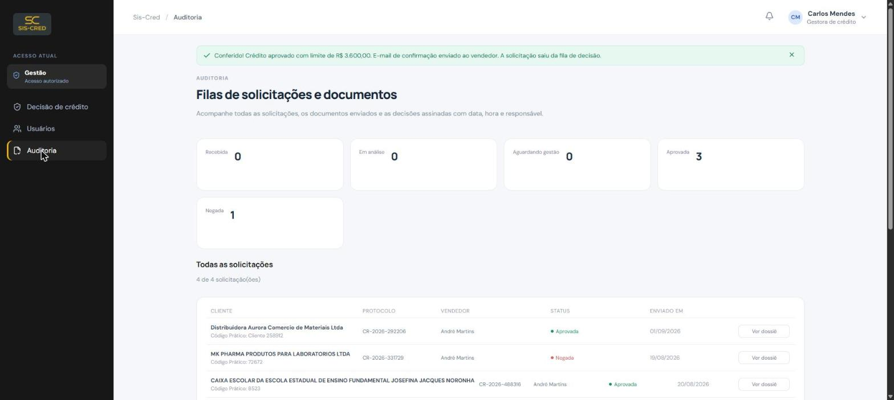

- **Trilha de auditoria**: histórico cronológico de eventos por cliente (ficha criada, documento enviado, status atualizado, decisão registrada, confirmação no Prático), com filtros por tipo de evento, período (data de/até) e busca por protocolo, cliente ou código.
- **Exportar CSV**: baixa a trilha de auditoria filtrada em um arquivo `.csv`.

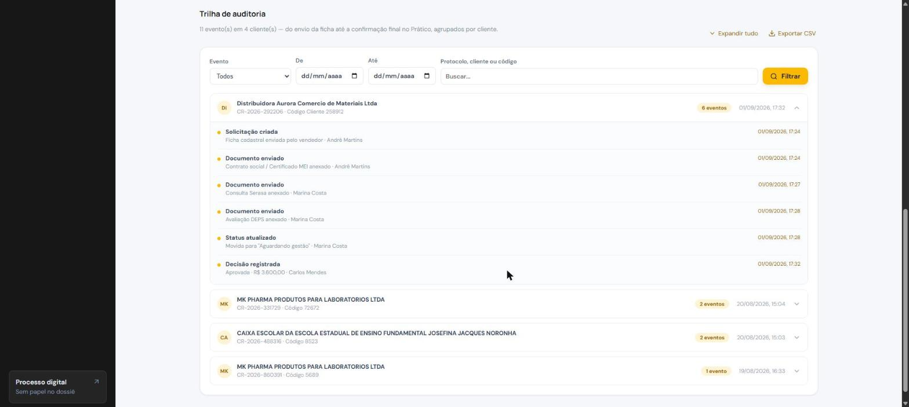

## 8. Status das solicitações

| Status | Significado |
|---|---|
| Recebida | Ficha enviada pelo vendedor, ainda não iniciada pela analista |
| Em análise | Analista está montando o dossiê (relatórios de crédito) |
| Aguardando gestão | Dossiê completo, aguardando parecer da gestão |
| Aprovada | Crédito aprovado, com limite definido; aguarda confirmação no Prático |
| Negada | Crédito negado; aguarda confirmação no Prático |

Depois de Aprovada/Negada, a solicitação entra na fila **Pendentes de confirmação** da Analista até ser confirmada no Prático, quando passa para o **Histórico**.

## 9. Referência rápida de permissões

| Ação | Vendedor | Analista | Gestão | Admin |
|---|:---:|:---:|:---:|:---:|
| Criar autocadastro (registro) | ✔ | — | — | — |
| Cadastrar nova solicitação de crédito | ✔ | — | — | ✔ |
| Ver apenas as próprias solicitações | ✔ | — | — | — |
| Ver todas as solicitações | — | ✔ | ✔ | ✔ |
| Anexar contrato social | ✔ | ✔ | — | ✔ |
| Anexar Serasa / DEPS | — | ✔ | — | ✔ |
| Enviar dossiê para a gestão | — | ✔ | — | ✔ |
| Aprovar / negar crédito | — | — | ✔ | ✔ |
| Confirmar atualização no Prático | — | ✔ | — | ✔ |
| Criar/suspender/trocar senha de Vendedor, Analista, Gestão | — | — | ✔ | ✔ |
| Criar/suspender/trocar senha de Administrador | — | — | — | ✔ |
| Ver auditoria completa | — | — | ✔ | ✔ |
| Ver painel administrativo (indicadores) | — | — | — | ✔ |

## 10. Dúvidas e suporte

Para problemas de acesso (senha, usuário suspenso, função incorreta), procure um usuário de **Gestão** ou **Administrador** do sistema, responsáveis por criar e gerenciar os acessos.
