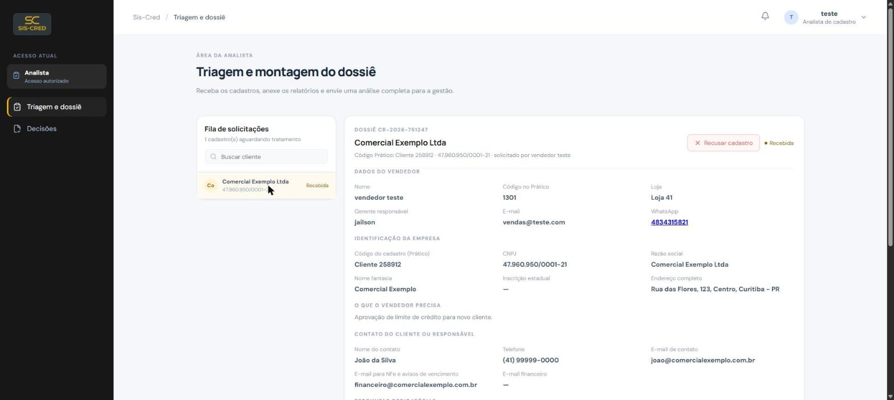
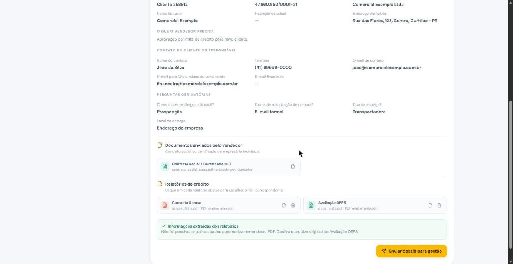
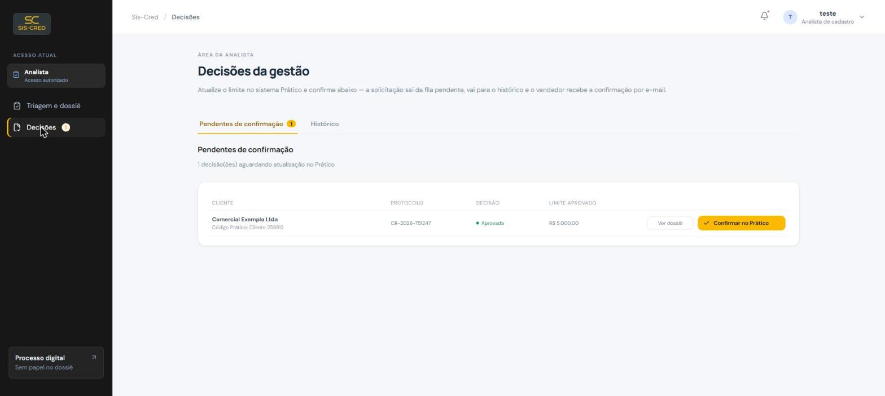
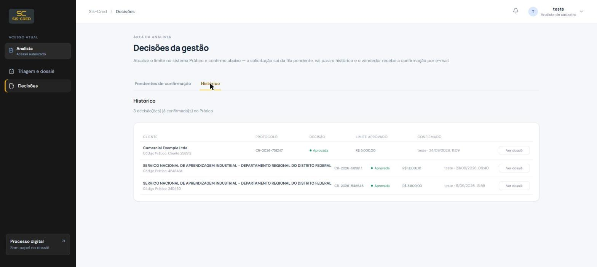

# Manual da Analista — Sis-Cred

Guia rápido para triagem, montagem do dossiê e confirmação de decisões no Sis-Cred.

**Acesse:** https://credito.delupod.local

## Seu papel no processo

Você é a ponte entre o vendedor e a gestão: recebe a ficha cadastral, monta o dossiê de crédito com os relatórios (Serasa e DEPS) e, depois que a gestão decide, confirma a atualização no sistema Prático.

1. **Triagem** — receba a ficha do vendedor em "Triagem e dossiê" e confira os dados.
2. **Montagem do dossiê** — anexe os relatórios Serasa e DEPS do cliente.
3. **Envio à gestão** — envie o dossiê completo para decisão.
4. **Confirmação final** — depois da decisão, atualize o Prático e confirme no sistema.

## 1. Triagem e montagem do dossiê

No menu lateral, clique em **Triagem e dossiê**. A fila mostra todas as fichas enviadas pelos vendedores. Selecione um cliente para ver os dados completos da solicitação.

## 2. Anexando os relatórios de crédito

- Role até **Relatórios de crédito** e clique para escolher o PDF da **Consulta Serasa**.
- Faça o mesmo para a **Avaliação DEPS**.
- O sistema tenta extrair automaticamente os dados do PDF (classificação, limite sugerido, risco). Se não conseguir, confira o arquivo original — o envio não fica bloqueado por isso.
- Com os dois relatórios anexados, clique em **Enviar dossiê para gestão**. O status muda para "Aguardando gestão" e a ficha sai da sua fila.

## 3. Confirmando a decisão no Prático

Quando a gestão aprova ou nega um crédito, a solicitação aparece em **Decisões → Pendentes de confirmação**. Atualize o limite no sistema Prático e só depois clique em **Confirmar no Prático** — isso avisa o vendedor por e-mail e move o caso para o histórico.

## Precisa de ajuda?

Dúvidas sobre relatórios, permissões ou acesso: procure a **Gestão** ou um **Administrador**. Eles são responsáveis por criar e gerenciar os acessos de toda a equipe.
