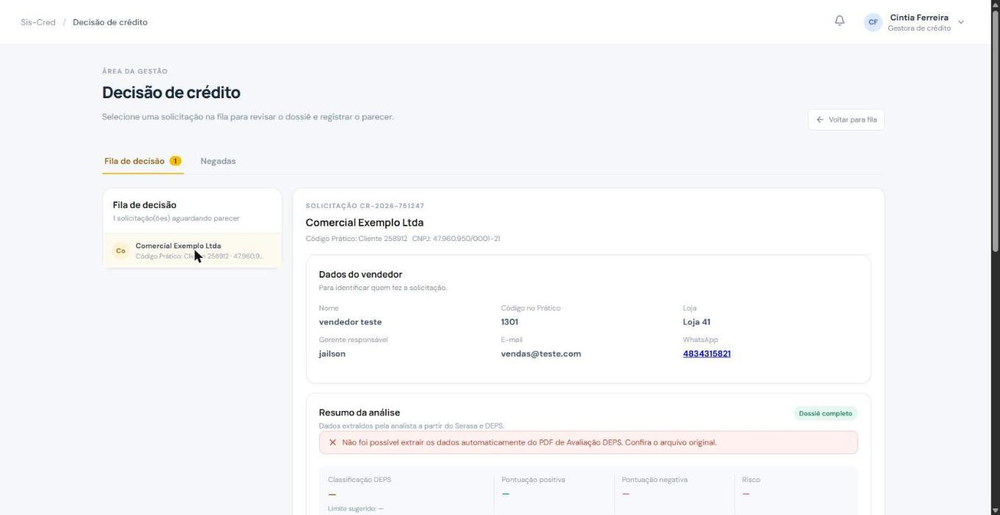
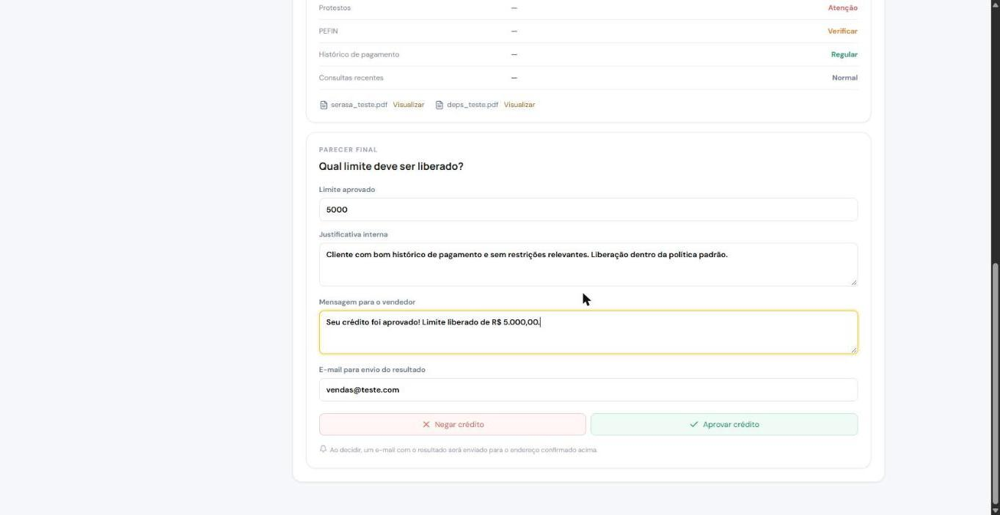
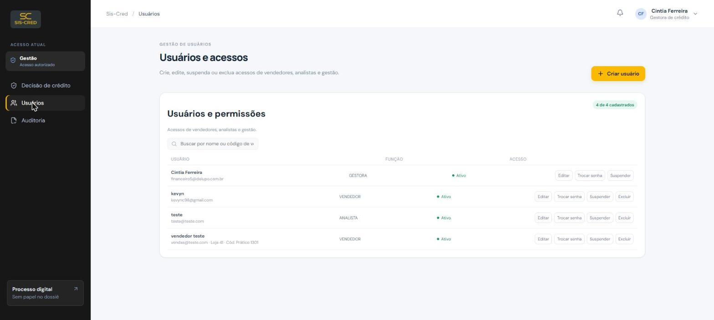
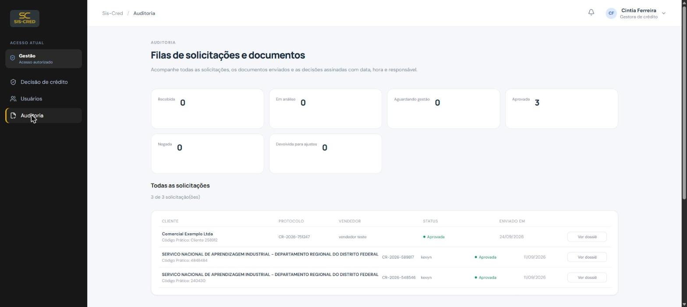
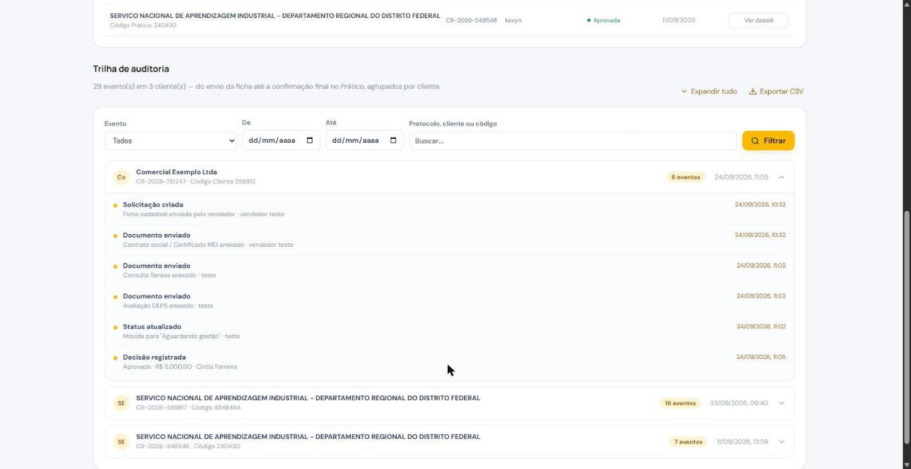

# Manual da Gestão — Sis-Cred

Guia rápido para decidir crédito, gerenciar usuários e acompanhar a auditoria no Sis-Cred.

**Acesse:** https://credito.delupod.local

## Seu papel no processo

Você recebe o dossiê completo montado pela analista (dados do cliente + relatórios de crédito) e decide: aprova ou nega o limite. Além disso, você gerencia os acessos de vendedores e analistas e acompanha a auditoria completa do sistema.

1. **Fila de decisão** — revise o dossiê completo: dados do cliente e relatórios de crédito.
2. **Parecer final** — defina o limite, justifique internamente e escreva a mensagem ao vendedor.
3. **Aprove ou negue** — um e-mail com o resultado é enviado automaticamente ao vendedor.
4. **Gerencie e audite** — crie/suspenda usuários e acompanhe toda a trilha de eventos.

## 1. Decisão de crédito

No menu lateral, clique em **Decisão de crédito**. A fila mostra as solicitações que a analista já enviou, com o dossiê completo (dados do vendedor, da empresa e do cliente).

## 2. Registrando o parecer final

- Confira o **resumo da análise** (classificação DEPS, protestos, PEFIN, histórico de pagamento) e, se precisar, abra os PDFs originais do Serasa e do DEPS.
- Preencha o **limite aprovado** (já vem preenchido com o limite sugerido, mas pode editar).
- Escreva a **justificativa interna** (só gestão e analista veem) e a **mensagem para o vendedor** (o que ele vai ver em "Minhas solicitações").
- Confirme o e-mail de envio do resultado e clique em **Aprovar crédito** ou **Negar crédito**. O e-mail sai na hora e a solicitação some da fila.

## 3. Usuários e permissões

Em **Usuários**, você cria, edita, suspende ou troca a senha de Vendedores, Analistas e outros usuários de Gestão. Administradores só podem ser gerenciados por outro Administrador.

- **Criar usuário**: nome, e-mail corporativo, função e senha inicial.
- **Trocar senha**: define uma nova senha para o usuário selecionado.
- **Suspender / Reativar**: bloqueia ou libera o acesso sem excluir o cadastro.

## 4. Auditoria completa

Em **Auditoria**, você vê todas as solicitações do sistema (com contadores por status) e a trilha cronológica de eventos de cada cliente.

- Filtre por tipo de evento, período (data de/até) ou busque por protocolo, cliente ou código.
- **Exportar CSV** baixa a trilha filtrada para um arquivo.

## Precisa de ajuda?

Para dúvidas técnicas ou problemas de acesso que você não consegue resolver, procure um **Administrador** do sistema.
