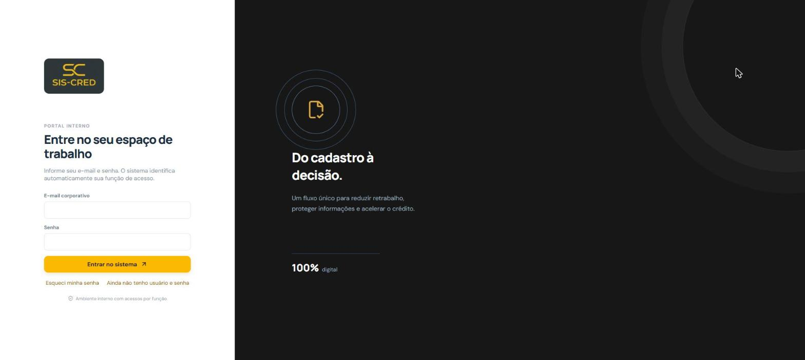
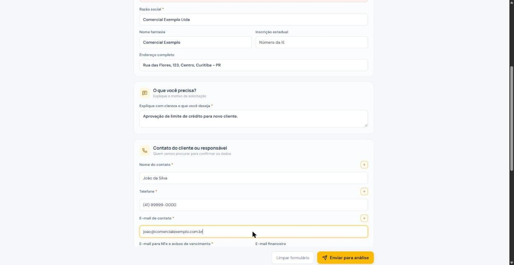
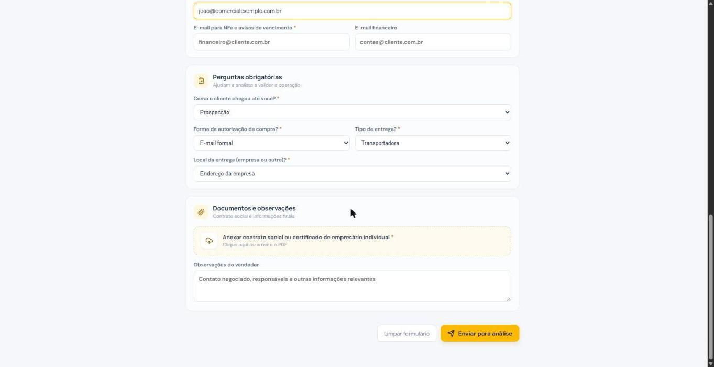
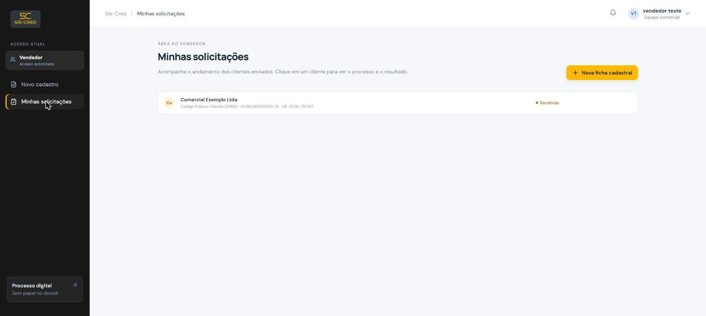
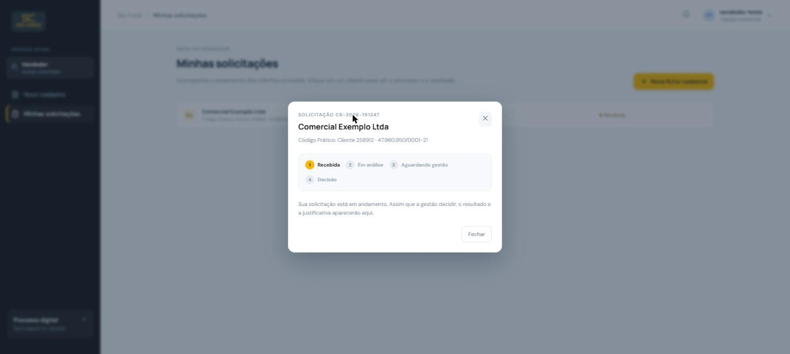

# Manual do Vendedor — Sis-Cred

Guia rápido para cadastrar clientes e acompanhar suas solicitações de crédito no Sis-Cred.

**Acesse:** https://credito.delupod.local

## Como funciona o processo

1. **Você cadastra o cliente** — preenche a ficha com os dados da empresa e anexa o contrato social.
2. **A analista faz a triagem** — monta o dossiê com os relatórios de crédito (Serasa e DEPS).
3. **A gestão decide** — aprova ou nega o limite de crédito.
4. **Você é avisado** — recebe um e-mail e vê o resultado em "Minhas solicitações".

## 1. Como acessar

### Ainda não tenho conta

1. Na tela de login, clique em **"Ainda não tenho usuário e senha"**.
2. Informe nome, e-mail e uma senha (mínimo de 8 caracteres, com letras e números).
3. Pronto — já pode entrar com esse e-mail e senha.

Só o perfil **Vendedor** pode se autocadastrar. Se precisar de outro tipo de acesso, fale com a Gestão.

### Esqueci minha senha

1. Clique em **"Esqueci minha senha"** e informe seu e-mail cadastrado.
2. Você recebe um link de redefinição válido por 30 minutos.

### Funções disponíveis no menu do perfil (canto superior direito)

- **Editar perfil**: trocar nome e foto (JPG, PNG ou WEBP, até 3MB).
- **Trocar senha**: pede a senha atual, a nova e a confirmação.
- **Notificações** (sino no topo): avisos sobre suas solicitações.
- **Sair do sistema**.

## 2. Cadastrando um novo cliente

No menu lateral, clique em **Novo cadastro**. Preencha os dados da empresa, explique o que precisa e informe o contato do cliente.

- **Buscar no Prático**: escolha buscar pelo **código do cliente** (cd_cliente) ou pelo **CNPJ/CPF**, digite e clique em "Buscar no Prático e preencher" — o sistema traz o cadastro do Prático e preenche código, documento, razão social, nome fantasia, IE, endereço e contato. Se houver mais de um cadastro com o mesmo documento, escolha o correto na lista.
- **Perguntas obrigatórias**: origem do cliente, forma de compra e tipo de entrega.
- **Documento**: anexe o contrato social ou o certificado de MEI em PDF (obrigatório).
- Revise e clique em **Enviar para análise**. Você recebe um número de protocolo na hora.

## 3. Acompanhando sua solicitação

Clique em **Minhas solicitações** para ver todos os clientes que você cadastrou e o status atual de cada um.

**O que você vê ao final:**

- Se aprovado: o limite liberado e a mensagem da gestão.
- Se negado: a mensagem da gestão com o motivo resumido.
- Você **não** vê a justificativa interna da decisão nem os documentos de crédito (Serasa/DEPS) — apenas o resultado final.

## 4. O que significa cada status

| Status | O que significa |
|---|---|
| Recebida | Sua ficha foi enviada e ainda não foi iniciada pela analista |
| Em análise | A analista está montando o dossiê (relatórios de crédito) |
| Aguardando gestão | Dossiê completo, aguardando o parecer da gestão |
| Aprovada | Crédito aprovado, com limite definido |
| Negada | Crédito negado |

Depois de **Aprovada** ou **Negada**, a analista ainda precisa confirmar a atualização no sistema Prático — quando isso acontece, você recebe um e-mail avisando que o processo foi concluído.

## 5. Dúvidas e suporte

Para problemas de acesso (senha, usuário suspenso, função incorreta) ou dúvidas sobre o sistema, procure um usuário de **Gestão** ou **Administrador**, responsáveis por criar e gerenciar os acessos.
